# Mac OS 9.2.1 Configuration Guide to use qemu-ppc-screamer fork

Mac OS 9.2.1 Configuration Guide was written by **Samie Konet** during her practicum with the **[Rhizome Digital Preservation](https://rhizome.org/tags/preservation/)** department in Spring 2023.

[Qemu](https://www.qemu.org/), the open-source emulator used in this guide, follows a varied installation process between mac OS and Windows hosting systems. This guide is written following instructions for compiling a Mac OS 9.2.1 emulator using [Ubuntu 22.04](https://ubuntu.com/#download), a Linux subsystem for Windows, after completing the intiating the [qemu-screamer](https://github.com/rhizomedotorg/qemu-ppc-screamer) fork to enable audio and networking capabilities in the Mac OS 9.2.1 software environment.


The configuration guide is written under the assumption that the reader is somewhat familiar and comfortable with a command terminal and compiling software from a source, or is excited to learn through following the guided process below. 

If you do not have [Qemu](https://www.qemu.org/) installed on your machine, please review the Qemu website for installation instructions, which varies between macOS and Windows hosting systems. 


The Mac OS 9.2.1 Configuration Guide includes an outlined **************************************Build, Installation,************************************** and ******************************Orchestration****************************** process. 


## Build Instructions:

### Step 1: Locating folder for build
Prepare for Qemu-system-ppc installation by locating the *build* folder which is housed within *qemu/qemu-screamer/* folder inside of your Local Disk (C:). 

### Step 2: Download and unpack 1 CD image (iso) for Apple Mac OS 9.2.1

For this installation we will download a copy of Apple Mac OS 9.2.1 sourced from the “Mac OS 9” Library hosted on [WinWorld.](https://winworldpc.com/download/3dc3a37f-6518-c39a-11c3-a4e284a2c3a5)

Extract “macos921_ppc.iso” (iso Archive) from downloaded .zip folder and place in *qemu/qemu-screamer/build* folder. 

## Installation Instructions:

### Step 1: Create a hard disk image with qemu-ing to hold the installation:

Open Ubuntu or your favorite terminal to create disk image:
```
qemu-img.exe create -f qcow -o size=10G name-of-hard-disk-image.qcow2 
```
### Step 2: Creating the batch file

Open up your favorite text editor and paste the following code below:

```bash
#!bin/bash
#cd qemu/qemu-screamer/build

./qemu-system-ppc \
-accel tcg,tb-size=2048 \
-machine mac99,via=pmu \
-prom-env "boot-args=-v" \
-prom-env "vga-ndrv?=true" \
-cpu g4 \
-m 896 \
-g 800x600x32 -device VGA,edid=on,vgamem_mb=64,xres=800,yres=600 \
-monitor stdio \
-cdrom Name-of-cdrom-file.iso \
-hda Name-of-hard-disk-image.qcow2 \
-boot d \

```

Save file as a shell script (.sh) into your *build* folder.


Return to Ubuntu/Linux terminal and run the command to launch the Mac OS 9.2.1 installation:

```
./Name-of-shell-script.sh
```


You will be welcomed with the Mac OS 9.2 Installation Start-Up screen.

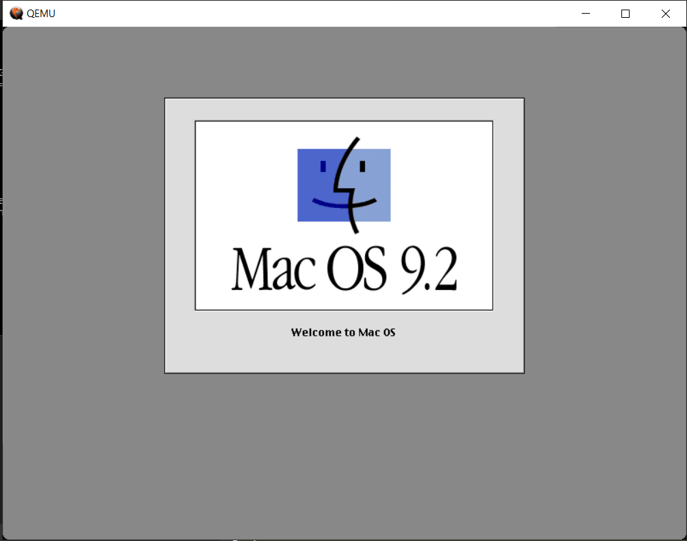


### Step 3: Disk Utility process

Qemu will open a new window to display the Mac OS 9 start-up screen.


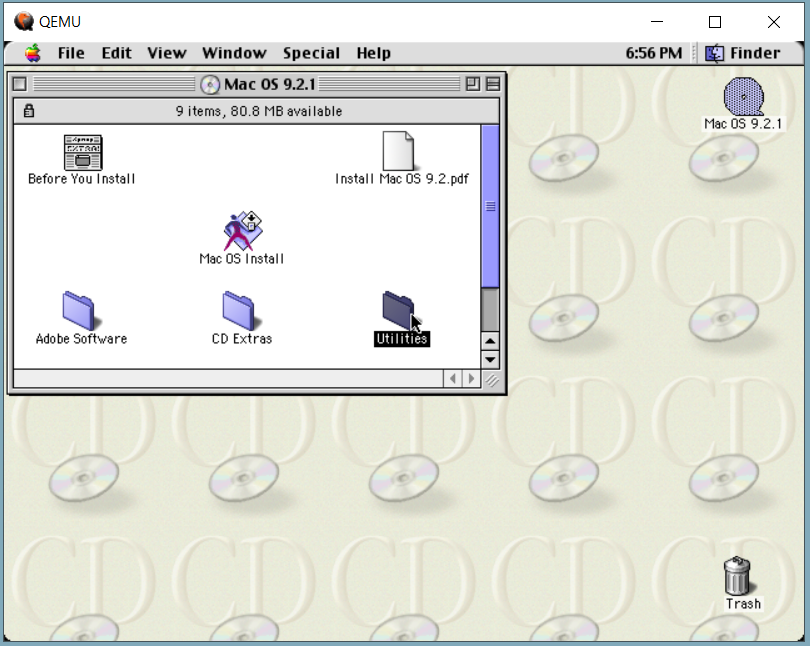

Select ********Utilities******** folder in *Mac OS 9.2.1* desktop window.

Select ********Drive Set-up********.

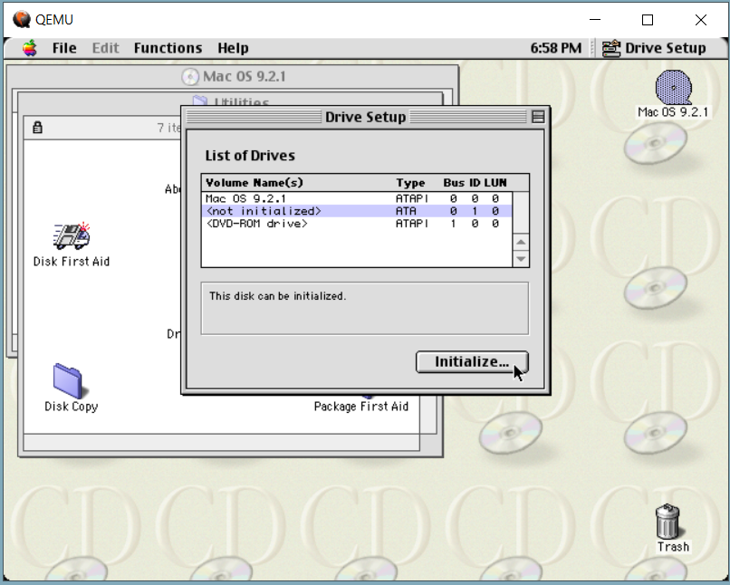


In the *List of Drives*, select the Volume titled <*not initialized*>. 
Select ********Initialize******** button in the lower right corner of the window to run the disk utility process. 

A “Initialization was successful” message will appear when the process is complete.

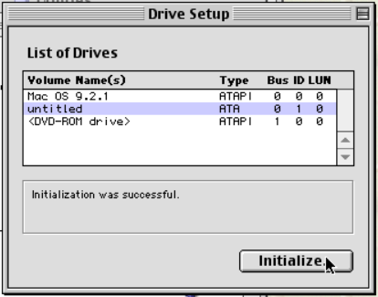

Close out of ********Drive Setup******** after Initialization is complete and return to the Mac OS 9.2.1 installation window.

### Step 4: Install Mac OS 9.2.1

Select ********Mac OS Install******** application located in the center of the installation window. A *Welcome* screen will appear to prompt you through the installation process.

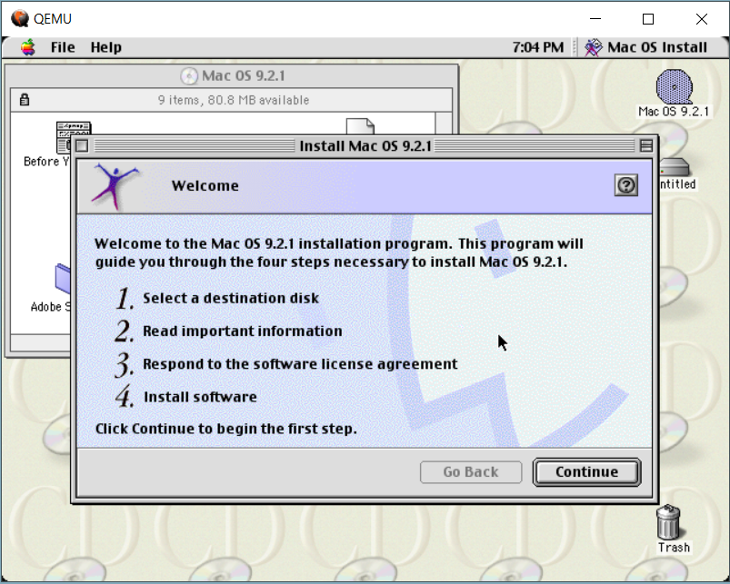

You will be prompted to select a installation destination. The *Destination Disk* should be set to our “untitled” disk we created in the previous *Disk Utility Process* following **********Step 3**********. 


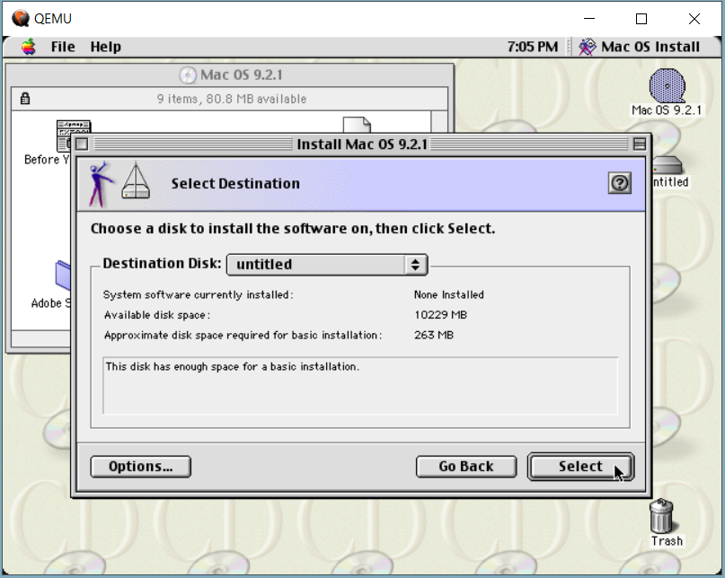

When you have completed the installation prompts, click ********Start******** to run the installation. 

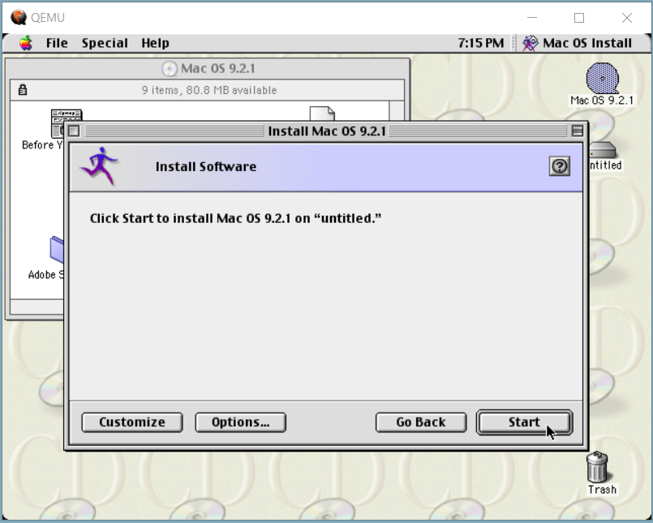


The installation process will take approximately 10 minutes depending on the selection of components initiated with the installation. (Installation may take more or less time depending on the build of the hosting PC.)

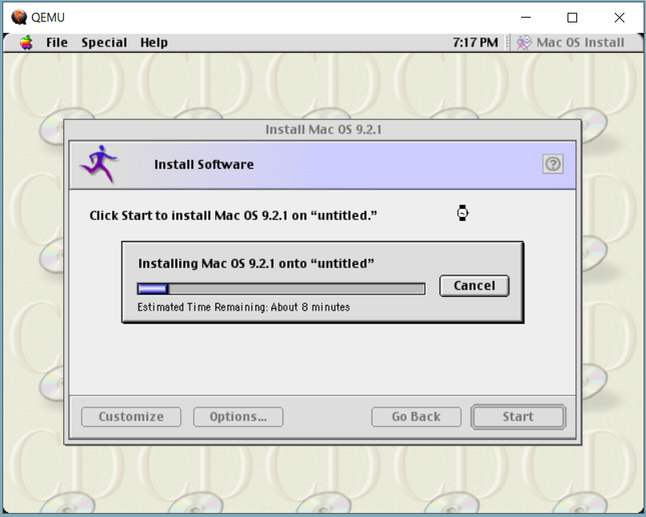

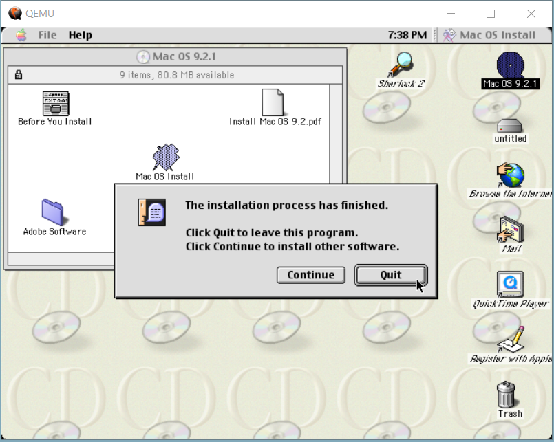


When the installation reaches the restarting phase, you may select ********Quit********. You may now close the qemu window completely and continue to the next step by returning to our shell script from ****************Step 2.**************** 

### Step 5: Booting from Mac OS 9.2.1 CD1 (continued)

Return to shell script file which you previously used to install Mac OS 9.2.1 CD.

Adjust the command in this file to read as the following:

```bash
#!bin/bash
#cd qemu/qemu-screamer/build

./qemu-system-ppc \
-accel tcg,tb-size=2048 \
-machine mac99,via=pmu \
-prom-env "boot-args=-v" \
-prom-env "vga-ndrv?=true" \
-cpu g4 \
-m 896 \
-g 800x600x32 -device VGA,edid=on,vgamem_mb=64,xres=800,yres=600 \
-monitor stdio \
-cdrom Name-of-cdrom-file.iso \
-hda Name-of-hard-disk-image.qcow2 \
-boot c \

```

It is important to change the argument from -boot d to -boot c, and to reverse the order of the hard disk and CD-ROM entry. By reversing the order of the installation, it allows the system to boot from the hard disk in order to continue the installation from CD 1.

After adjusting the command, you will save the shell script file with these new edits to update the command.

Run command in Ubuntu/Linux terminal: 
```
./Name-of-shell-script.sh
```

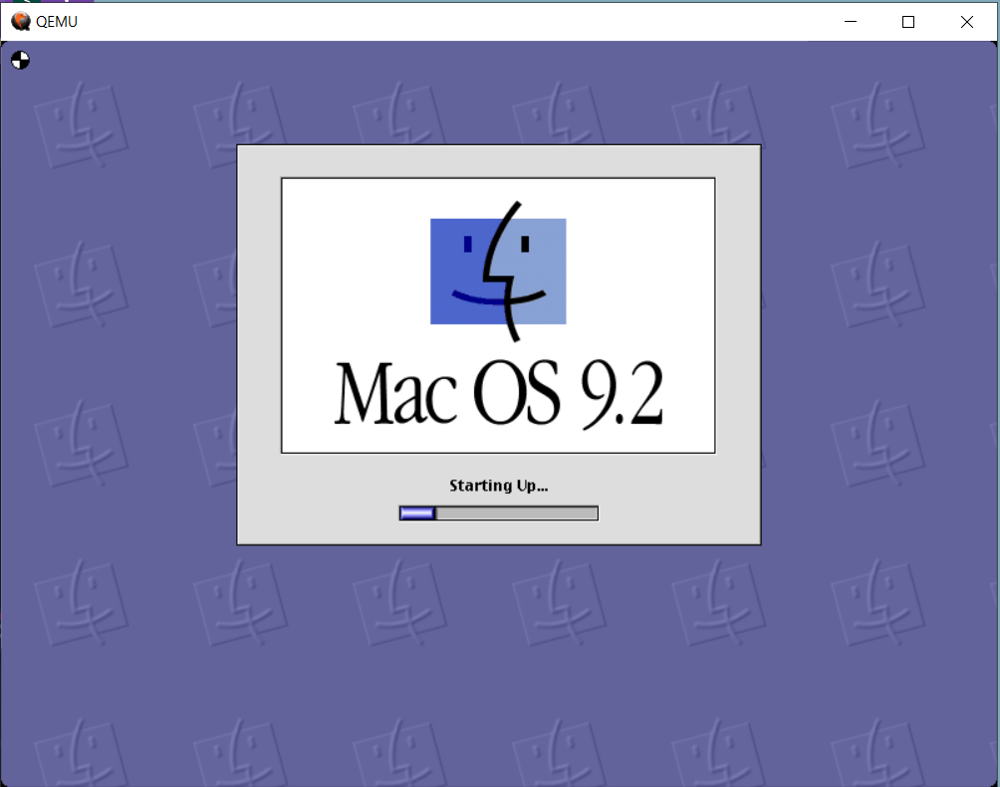

If the installation was completed without error, qemu will launch the Mac OS 9.2 Desktop.

## Orchestration Instructions:

### Step 1: Mac OS 9.2.1 set-up process

Once the boot-up window closes, you will be greeted by the ********Mac OS Setup Assistant******** landing window to complete the installation process.

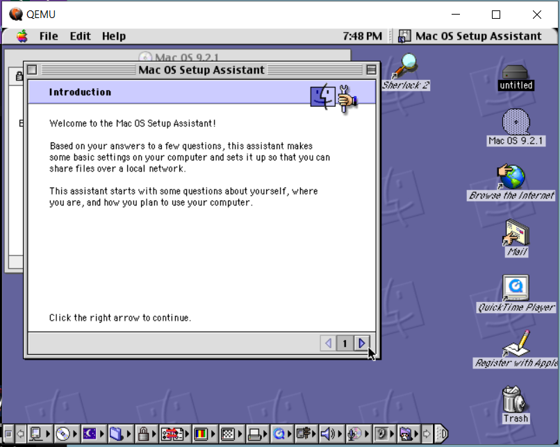

You will next be prompted through the installation set-up which will ask for the user to designate a User ID, a time-zone and will end with a prompt to add access to the network.

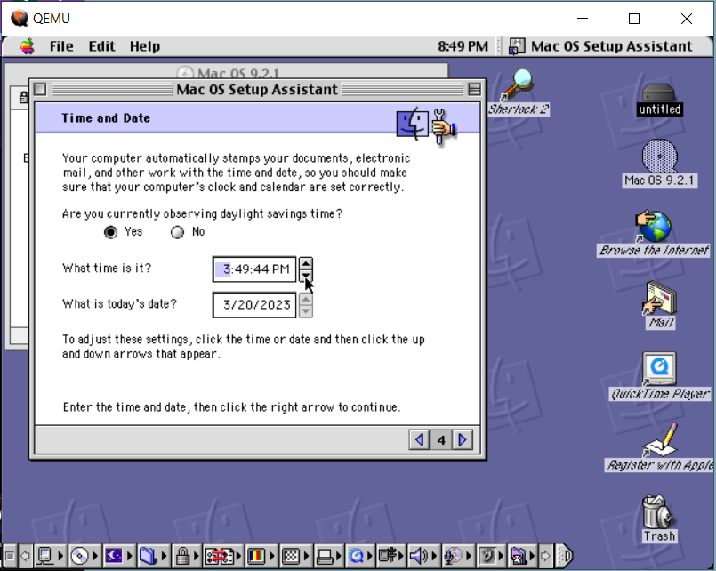

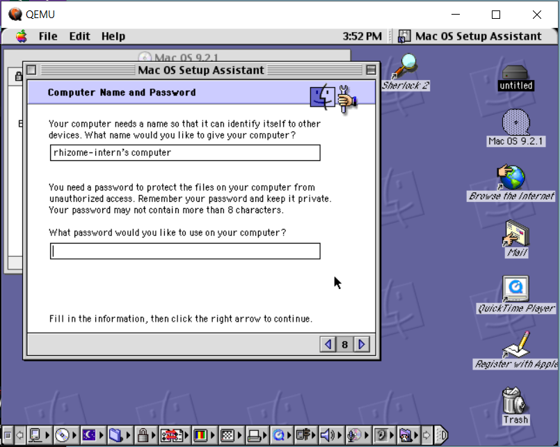

Once the registration process is complete, you will have access to the desktop and its featured applications.

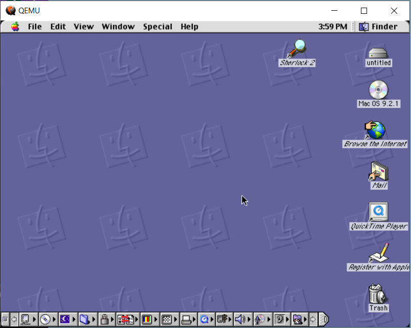


To exit the emulator, it is crucial that you perform a proper ********Shut Down********, which is located under the ********Special******** tab in the menu bar. Qemu will take a moment to perform the shut down process. You can then close the Qemu window.

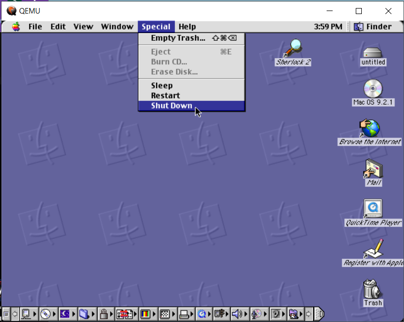


To open the emulator, you can easily start up the OS by running the shell script in your terminal. Qemu will start up and you will be returned to the desktop as referenced above.

